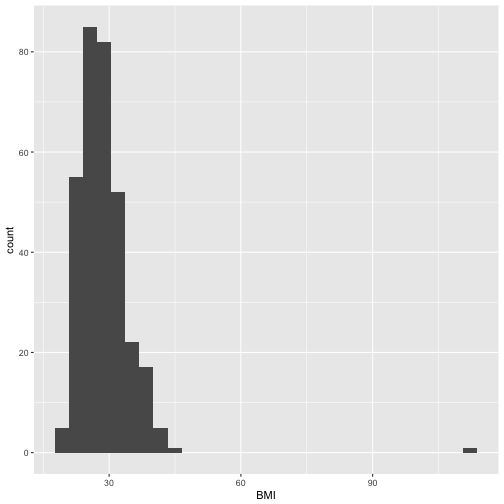
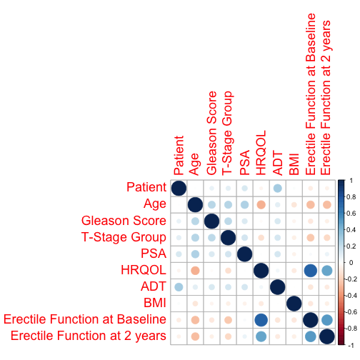

Interim Presentation
========================================================
author: Dylan Sun & Zijiang Yang
date: 
autosize: true

Objectives
========================================================

- Determining the erectile function rates following SBRT
- Determining predictors of erectile function preservation after SBRT

Hypotheses
========================================================
Negatively Associated:
- Age, Gleason Score, T-stage, PSA, ADT, BMI

Positively Associated:
- HRQOL, Erectile Function at Baseline

We expect HRQOL and Erectile Function at Baseline to be highly correlated, because erectile function is included in the questionnaire. 

Questions and Concerns
========================================================
- BMI Outlier



***
Subject 67 has a BMI of 112. 
This is theoretically possible.


========================================================



Tables
========================================================

| never_functional| gain_function| loss_function| retain_function|
|----------------:|-------------:|-------------:|---------------:|
|              153|            14|            70|              88|

Model
========================================================
$logit(EF2) = \beta_{intercept} + \beta_{age} Age + \beta_{Gleason} Gleason + \beta_{Tstage} TStage + \beta_{PSA} PSA \\
+ \beta_{HRQOL} HRQOL + \beta_{ADT} ADT + \beta_{BMI} BMI + \beta_{EFbase} EFBase$

Results
========================================================

|term                            |   estimate| std.error|  statistic|   p.value|
|:-------------------------------|----------:|---------:|----------:|---------:|
|(Intercept)                     |  0.7703800| 2.4906641|  0.3093070| 0.7570880|
|Age                             | -0.0610443| 0.0241676| -2.5258791| 0.0115409|
|`Gleason Score`                 |  0.0796421| 0.2499178|  0.3186730| 0.7499745|
|`T-Stage Group`                 | -0.5775284| 0.5316308| -1.0863337| 0.2773314|
|PSA                             |  0.0615445| 0.0343769|  1.7902897| 0.0734074|
|HRQOL                           |  0.0229020| 0.0081191|  2.8207450| 0.0047912|
|ADT                             | -0.7501227| 0.6054252| -1.2390014| 0.2153450|
|BMI                             | -0.0216384| 0.0301905| -0.7167285| 0.4735416|
|`Erectile Function at Baseline` |  1.4699717| 0.4362079|  3.3698883| 0.0007520|

Results
========================================================
Error rate = $\dfrac{\sum |predicted-actual|}{total}$

```
[1] 0.2338462
```

Future Plan
========================================================
