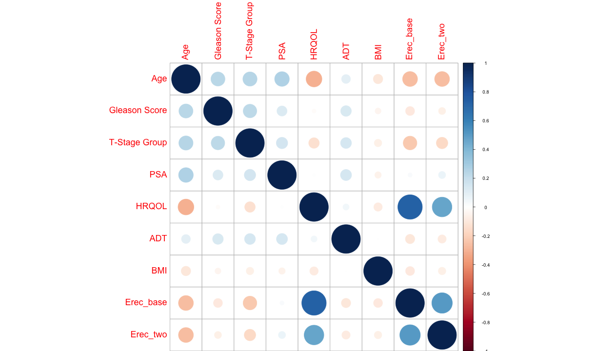

Interim Presentation
========================================================
author: Dylan Sun & Zijiang Yang
date: 
autosize: true


Objectives
========================================================

- Determining the erectile function rates following SBRT
- Determining predictors of erectile function preservation after SBRT
- If you undergo SBRT, how likely is it that you will lose erectile function?

Potential Predictors
========================================================
Negatively Associated:
- Age, Gleason Score, T-stage, PSA, ADT, BMI

Positively Associated:
- HRQOL, Erectile Function at Baseline

We expect HRQOL and Erectile Function at Baseline to be highly correlated, because erectile function is included in the questionnaire. 


How many people lose function?
========================================================
- At baseline:
158 with function, 167 without (0.49)

- At two years:
102 with function, 223 without (0.31)

- A seemingly large number of people lose function in just two years


| never_functional| gain_function| loss_function| retain_function|
|----------------:|-------------:|-------------:|---------------:|
|              153|            14|            70|              88|


Questions and Concerns
========================================================
- BMI Outlier


<iframe src="demo.html" style="position:left;height:100%;width:100%"></iframe>


***
Subject 67 has a BMI of 112. 
This is theoretically possible.


Multicollinearity
========================================================



Model
========================================================
$logit(EF2) = \beta_{intercept} + \beta_{age} Age + \beta_{Gleason} Gleason \\
+ \beta_{Tstage} TStage + \beta_{PSA} PSA + \beta_{HRQOL} HRQOL + \\ 
\beta_{ADT} ADT + \beta_{BMI} BMI + \beta_{EFbase} EFBase$

Results
========================================================

|term                            | lower|   OR| upper| p.value|
|:-------------------------------|-----:|----:|-----:|-------:|
|(Intercept)                     |  0.00| 0.03|  0.21|    0.07|
|centered_age                    |  0.92| 0.94|  0.96|    0.01|
|`Gleason Score`                 |  0.84| 1.08|  1.39|    0.75|
|`T-Stage Group`                 |  0.33| 0.56|  0.96|    0.28|
|PSA                             |  1.03| 1.06|  1.10|    0.07|
|HRQOL                           |  1.01| 1.02|  1.03|    0.00|
|ADT                             |  0.26| 0.47|  0.87|    0.22|
|BMI                             |  0.95| 0.98|  1.01|    0.47|
|`Erectile Function at Baseline` |  2.81| 4.35|  6.73|    0.00|

Results
========================================================
Error rate = $\dfrac{\sum |predicted-actual|}{total}$

```
[1] 0.2307692
```

Conclusions
========================================================
- Age, HRQOL, and erectile function are predictive of erectile function at two years
- PSA is somewhat protective
- Holding everything else constant, each one-year increase in baseline age increases the odds of losing erectile function by 6%. 
- Holding everything else constant, HRQOL score is protective of erectile function. 

Prediction
========================================================

| cen_age| Gleason Score| T_Stage|  PSA| HRQOL| ADT| BMI| Erec_base| prob_func| pred_func|
|-------:|-------------:|-------:|----:|-----:|---:|---:|---------:|---------:|---------:|
|    0.00|             7|       0|  7.7|    56|   0|  29|         1|      0.43|         0|
|   -7.14|             7|       0| 32.5|    88|   0|  25|         1|      0.92|         1|
|    7.86|             8|       1|  9.5|    25|   1|  27|         1|      0.07|         0|
|   -6.14|             7|       0|  5.4|    71|   0|  31|         0|      0.23|         0|
|   10.86|             7|       1| 13.9|     0|   1|  24|         0|      0.01|         0|
|    7.86|             7|       1|  2.9|     4|   0|  34|         0|      0.01|         0|


